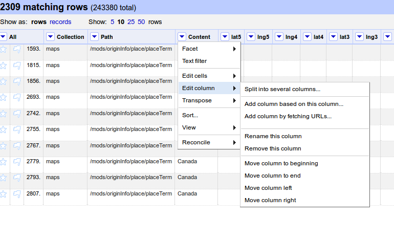
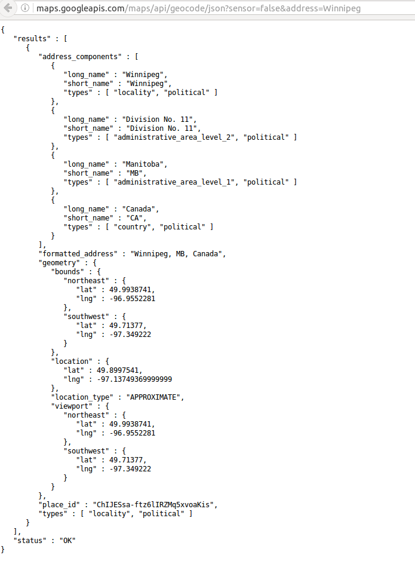
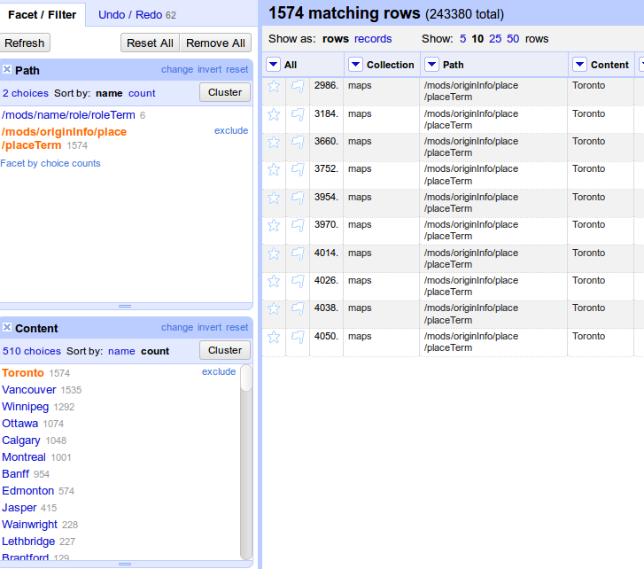

###Geocoding with OpenRefine

Open Refine can be used to translate addresses to latitude/longtitude coordinates to plot data on maps. 

There are several geocoding service you can use for this purpose:
 * Google Geocoding API
 * MapQuest Nominatim API
 * Geonames
 * Yahoo BOSS Geo Services

One thing to note is when using external API to extend your data, there is usually a usage limit on the number of requests you can send per day, and per second. 
####Google Geocoding API

Google Geocoding API request should have the following syntax:
http://maps.googleapis.com/maps/api/geocode/json?sensor=false&address=Edmonton

Steps:

1. Create a column by fetching URLs
  * Click on the arrow by any column name
  * Select "Edit column" -> "Add column by fetching URLs" 
   
  * In the popup window, add a column name 'geojson' for the new column
  * Use GREL to construct your API request URL (include the quotation marks). 
	*'http://maps.googleapis.com/maps/api/geocode/json?sensor=false&address='+escape(value,'url')*
    escape is to encode the geolocation string into a format that is safe for URLs. 
  * We can set the wait time between each request in Open Refine. 
  * Click on "Ok" to Proceed. 

  Please note that Google Geocoding API's limitation is 2,500 calls per day.

2. Fetch and parse the JSON
  * The API request above will return a JSON
  	
  * Create new column 'longtitude' by "Add column based on this column"
  * In the 'Expression' box, add the following code
     *value.parseJson().results[0].geometry.location.lng*
  * Create new column 'latitude' by "Add column based on this column"
  * In the 'Expression' box, add the following code
     *value.parseJson().results[0].geometry.location.lat*
3. Remove the 'geojson' column by clicking on "Edit Column" -> "Remove this column"


Tips:

If you have a lot of duplicated location to geocode:
* Clustering content by location 

* Geocoding this location by direct API call, or filter result set to one record and repeat the steps above
* Copy the geolocation information to all the other records by "Edit cells" -> "Fill down"

#####Exercise 1: Geocode a location in the dataset with Google Geocoding API

#####Exercise 2: Geocode a location that is duplicated in the dataset

####[MapQuest Nominatim Geocoding API](http://open.mapquestapi.com/nominatim/)

Based on data contributed to OpenStreetMap. It's open data and don't have preset limit on total usage per day, but a maximum of 1 request per second. To access their API, an API key is required and is available for [free](https://developer.mapquest.com/). 

Steps to use other geocoding services are exactly the same as above. 

API request for MapQuest Nominatim:

```'http://open.mapquestapi.com/nominatim/v1/search.php?key=YOUR_KEY_HERE&format=json&q=' + escape(value, 'url')```


####[Geonames](http://www.geonames.org/export/geonames-search.html)

Geonames data is free, and with cc-by license. It has a 30,000 daily limit per application (identified by the parameter 'username'), and 2000 requests per hour.
API request for Geonames
```http://api.geonames.org/search?name=Edmonton&username=demo```

#####Exercise 3 Geocode a location with another Geocoding service
