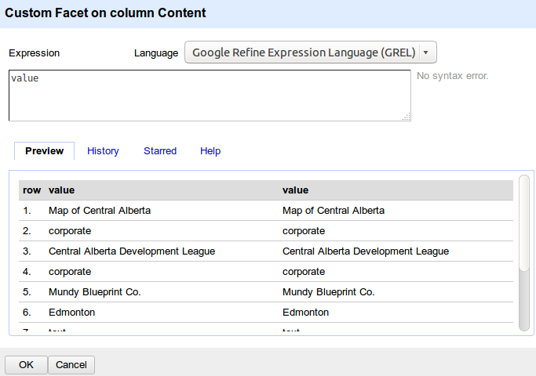

###GREL- General Refine Expression Language
GREL is a scripting language supported by Open Refine to allow users to create simple yet powerful query to filter and transform the datasets. 

It allows you to create customized transformation function when the available actions on Refine's menu don't support your need. 

####Where you can use GREL
 * When you create a custom text facet
 * When you transform a column using the transformation function
 * When you create a new column based on existing column
 * And when you create a new column by fetching URL

####What's available in the GREL window

In any GREL window you will find:
  * Expression text area - where you write your expressions and check if the expression is valid
  * Preview tab - Preview a sample of your data before and after the transformation with your GREL expression
  * History tab - List all the previous expression used in this project so you can reuse them easily
  * Starred tab - Allow you to build your personalized bookmark of GREL expressions. 
  * Help tab - List all the GREL functions available and their syntax. Or you can find more information on [OpenRefine Wiki](https://github.com/OpenRefine/OpenRefine/wiki/General-Refine-Expression-Language)

When your expression generate an error, Open Refine let you choose how to handle it. You can choose to:
* keep original
* set to blank
* store the error message. 

We recommend to keep the default behavior: keep original. 

#### [GREL Variables](https://github.com/OpenRefine/OpenRefine/wiki/Variables):
Basics
* Use the value in current column: *value*
* Use the value from another column: *cells['column_name'].value*
* Use quotes (single or double) for text. 

#### GREL Syntax
Function invocation in GREL has 2 forms:
* inside out: *trim(toLowercase(value))*
* in sequence: *value.toLowercase().trim()*

The second one make expressions easier to read, but it's a personal preference. 
