#Data Normalization in OpenRefine

##General Normalization Functions

OpenRefine can help with data that has internal problems. This application is great at fixing those problems while also considering the complete set of values in a dataset. Enhancing data with OpenRefine by bringing information from other sources is also possible and there are many ways to do that, like integrating data from other columns or fetching information from external services.

##Common scenarios

- Identifying unique values accross a dataset
- Identifying how many instances of a value exist in a dataset
- Identifying values that refer to the same concept (people, places, dates, etc.) but that are expressed inconsistently
- Separating values grouped together in a single cell
- Reformatting value structures
- Identifying missing information
- Enhancing data with information available elsewhere in your dataset or from an external resource.


##Sample dataset
For this workshop we will use an adapted version of the [Peel's Prairie Provinces](http://peel.library.ualberta.ca/index.html) metadata. This dataset contains a subset of metadata for the Maps and Postcards collections.

!(../screenshots/maps.png)
!(../screenshots/postcards.png)

Our end goal is to prepare the dataset for visualization in Tableau. To do so we will:
1) normalize and clean up the data
2) reconcile names against an external source
3) geocode a subset of the dataset


## OpenRefine Basics

###Layout
- Presents data in tabular format
- Each row represents a record (or part of it) in the data
- Each column represents a type of information
- Operations are started through column menus

###Exercise 1: Basic Operations
1) Reorder any column and remove another (we will undo this change so don't worry about losing data).

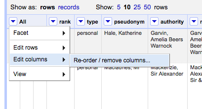
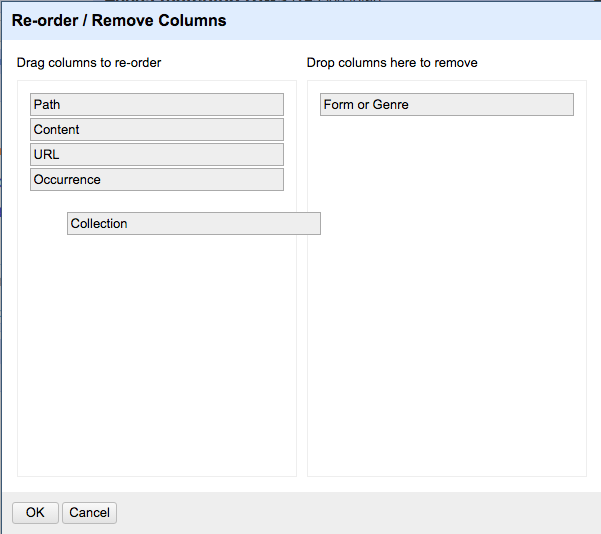

2) Rename the column "Ocurrence" to "Any Name"

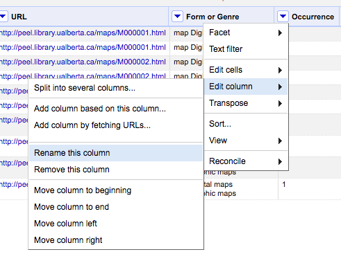

3) Undo the previous two actions by going to the *Undo/Redo* panel in the upper left corner, and clicking on the first project state (Create project) or the last action you want to go back to. Changes will be applied automatically.

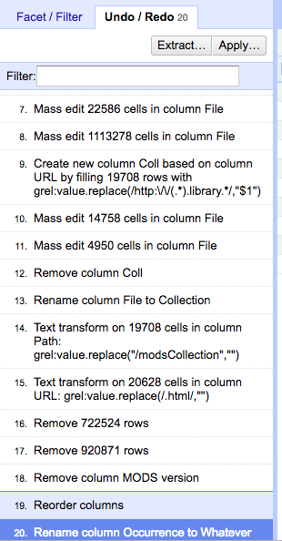


4) Sort data based on any of the columns. 

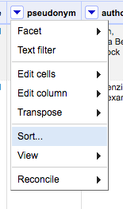

5) Go back to the *Facet/Filter* panel.

###Exercise #2: Faceting, Clustering, and Cleaning Up Data
1) Facet on the "Path" column

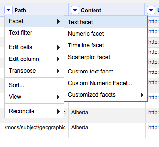

2) Facet on the "Content" column as well

3) If the "Content" facet does not display data, click on *Set count choice limit* to increase the number of facets allowed. For this excercise, set it up to 4000.

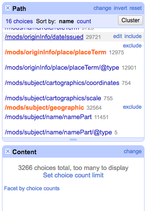

4) Click on two or three "Path" facets and see how the results adapt in the "Content" facet panel.

5) Reset your facets (you can use the *reset* option or hover over a facet and click on *exclude*).

6) Facet again, but this time we want to get all geographical names in the dataset. To do that, facet on the following paths only:

```
/mods/originInfo/place/placeTerm
/mods/subject/geographic
```

7) Check the "Content" data and correct a few values using facets. This option edits all instances of a value in one step. For example, it looks like there a few different values for "Calgary, AB". You can consolidate all values by editing the facets directly. Just click on the edit option, available from each facet:

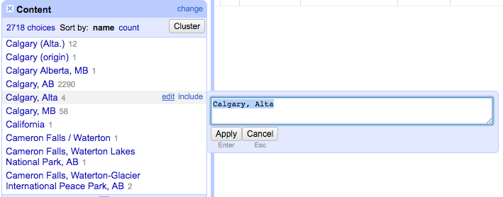

###Other facets
There are many other ways to facet data
***Numeric and Timeline*** facets needs numeric values, so text strings need to be converted to either a number or date format first. This option display graphs and not lists of values.

***Scatterplot facets*** display a graphical representation of numerical values for usually two variabes using Cartesian coordinates.

The ***word facet*** splits strings contained in cells into single words, counts their occurrences throughout the column, and then lists unique words and their occurrence count in the facet panel. This is a way of selecting rows where the contents of a particular column contain one or more specified words. (The user defined GREL custom text facet `split(value," ")` replicates this facet option.

The ***duplicates facet*** returns boolean values of true and false; filtering on true values returns all the rows that have duplicated values within a particular column; filtering on false displays all unique rows.

The ***text length*** facet produces a facet based on the character count of strings in cells within the faceted column; the custom numeric facet length(value) achieves something similar; the related measure, word count, can be achieved using the custom numeric facet `length(split(value," "))`.

###Excercise 3: Clustering Facet values
You can also use a number of clustering algorithms built into OpenRefine for seeing what values should probably be the same. 


1) Open your relevant facet, then click on the 'Cluster' button in the top right corner of the Facets box:

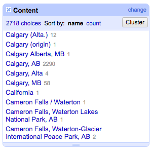

You can decide to merge matched values by checking their check box, then clicking on 'Merge Selected and Recluster'. You can change the clustering algorithms in that box as well.

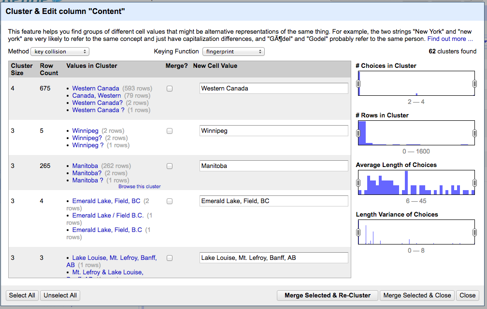


##Transformations
###Excercise #4: Transforming data

####Transforming with GREL and regular expressions
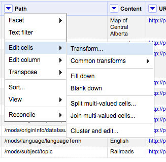
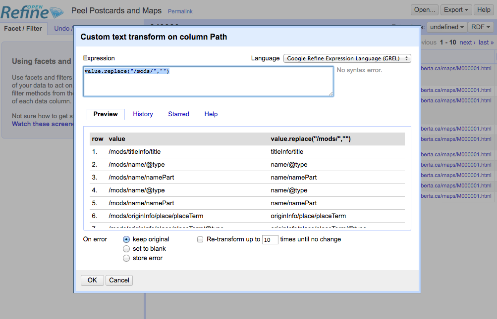

####Transforming with GREL and regular expressions


###Adding a New Column based off an Existing column

First make a new column...

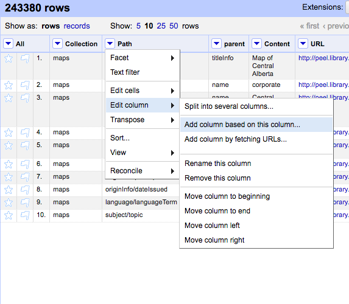

then apply GREL on the values you're mapping over to that new column, and give the column a name...


That GREL code:

```
value.replace('?', '').replace('-', '/')
```

You'll still need to do some cleanup on the facets.

###Compare Values in 2 columns

We're going to perform a GREL update. Choose one of the columns you wish to compare (easiest if this is the column you're okay with removing if it is an entire duplicate)...


Then build an IF statement in your GREL. The format is *IF(<condition>, action if condition is true, action if condition is false)*. *value* is the value of the cell in that chosen column; cells[column_name].values brings up the value for that cell, in the same row, for a different column. So for column values comparison:


That GREL code:

```
if(value == cells['title'].value, value.replace(value, ''), value)
```

Now faceted the updated column to see what values differ, and decide how to handle them.


##Sources:
http://enipedia.tudelft.nl/wiki/OpenRefine_Tutorial

http://www.meanboyfriend.com/overdue_ideas/wp-content/uploads/2014/11/Introduction-to-OpenRefine-handout-CC-BY.pdf

https://github.com/LODLAM/LODLAMTO16/tree/master/OpenRefine_Tutorial/Instructions/Cleaning