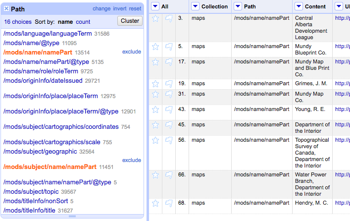
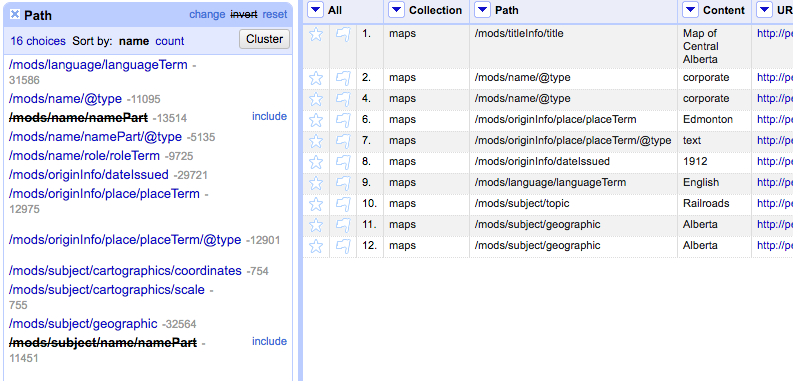
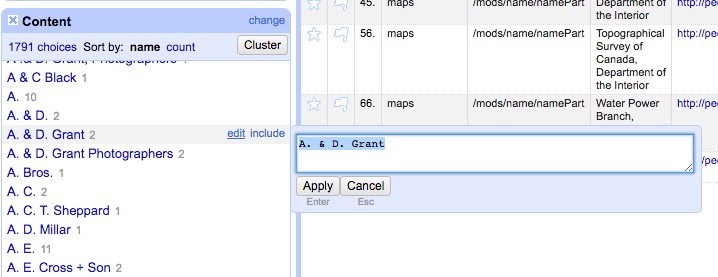
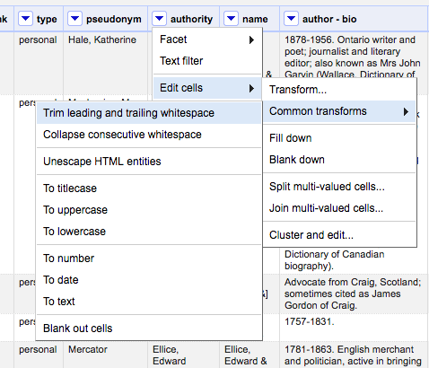

#Data Normalization in OpenRefine

##General Normalization Functions

OpenRefine can help with data that has internal problems and is very good at fixing them while also considering the complete set of values in a dataset. You can also enhance your data by bringing information from other sources.

##Common scenarios

- Identifying unique values accross a dataset
- Identifying how many instances of a value exist in a dataset
- Identifying values that refer to the same concept (people, places, dates, etc.) but that are expressed inconsistently
- Separating values grouped together in a single cell
- Reformatting value structures
- Identifying missing information
- Enhancing data with information available elsewhere in your dataset or from an external resource.


### OpenRefine's Layout
- Presents data in tabular format
- Each row represents a record (or part of it) in the data
- Each column represents a type of information
- Operations are started through column menus

####Basic operations:
Reordering / removing columns


Renaming columns


Sorting data


####Faceting
filter data


include multiple values


invert filters



Value editing through facets


Numeric and Timeline facets: these facets display graphs and not lists of values.

Scatterplot facets display scatter graphs or charts for usually two variabes using Cartesian coordinates.

####Text filters

####Filtering and Removing rows


###Transformations
####Trimming whitespace



###Adding a New Column based off an Existing column

First make a new column...


then apply GREL on the values you're mapping over to that new column, and give the column a name...


That GREL code:

```
value.replace('?', '').replace('-', '/')
```

You'll still need to do some cleanup on the facets.

###Compare Values in 2 columns

We're going to perform a GREL update. Choose one of the columns you wish to compare (easiest if this is the column you're okay with removing if it is an entire duplicate)...


Then build an IF statement in your GREL. The format is *IF(<condition>, action if condition is true, action if condition is false)*. *value* is the value of the cell in that chosen column; cells[column_name].values brings up the value for that cell, in the same row, for a different column. So for column values comparison:


That GREL code:

```
if(value == cells['title'].value, value.replace(value, ''), value)
```

Now faceted the updated column to see what values differ, and decide how to handle them.

###Clustering Facet values

You can also use a number of clustering algorithms built into OpenRefine for seeing what values should probably be the same. Open your relevant facet, then click on the 'Cluster' button in the top right corner of the Facets box:


You can decide to merge matched values by checking their check box, then clicking on 'Merge Selected and Recluster'. You can change the clustering algorithms in that box as well.


##Sources:
http://enipedia.tudelft.nl/wiki/OpenRefine_Tutorial
http://www.meanboyfriend.com/overdue_ideas/wp-content/uploads/2014/11/Introduction-to-OpenRefine-handout-CC-BY.pdf
https://github.com/LODLAM/LODLAMTO16/tree/master/OpenRefine_Tutorial/Instructions/Cleaning