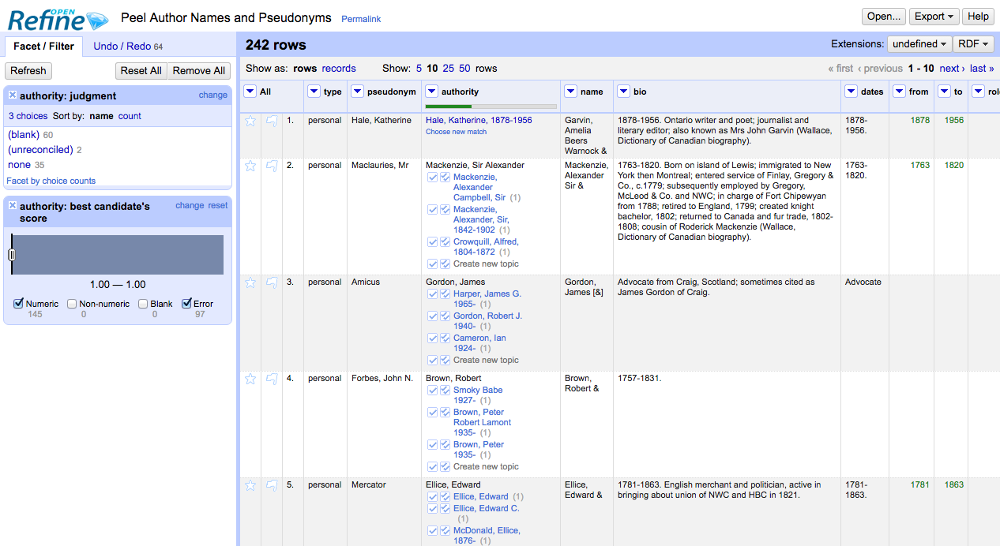

#Data Reconciliation with OpenRefine

In this tutorial we will go through one reconciliation method. Reconciliation is a fancy term for the process of matching people mentioned in our data against equivalent records from other name registries like VIAF by pulling their correspondent identifiers.

There are many ways to work on data reconciliation with OpenRefine:
- Built-in tools are available from the **Reconciliation** submenu. It is also possible to reconcile fetching information from remote resources via the **Add column by fetching URLs** tool.
- There are around 8 plugins that extend the reconciliation functionality. Some are available from the [OpenRefine download page](http://openrefine.org/download.html).
- OpenRefine integrates with [around 16 reconciliation services](https://github.com/OpenRefine/OpenRefine/wiki/Reconcilable-Data-Sources).

##Dataset
Import the [Peel Author Names and Pseudonyms OpenRefine project] available from [https://github.com/code4libyeg/openrefine_workshop_2016/blob/master/Data/Peel-Author-Names-and-Pseudonyms.openrefine.tar.gz](https://github.com/code4libyeg/openrefine_workshop_2016/blob/master/Data/Peel-Author-Names-and-Pseudonyms.openrefine.tar.gz). This dataset contains author names, pseudonyms, and biographical information from the Peel Monographs and Serials special collection.

##Reconciling author names using Open Refine and VIAF
For this exercise we will call a service that can be used to reconcile author names. It uses the Virtual International Authority File (VIAF) API. Using this service we can match authors to VIAF identifiers, widely used in Wikipedia pages and many libraries.

To get started, in the column "Authority", go to the **Edit cell > Reconcile** tool.

In the reconcile window Add the service:
`http://iphylo.org/~rpage/phyloinformatics/services/reconciliation_viaf.php`

It might take a while to connect to the service.

In the reconcile window you will see options to use data from other columns and to map those columns to specific ontology types. As you type you will see suggestions based on your input that display infoboxes for suggested ontology classes or subclasses. For this excercise, select the following options and classs:
1. Reconcile against type: Author
2. Select the columns 'pseudonym', 'bio', 'dates'.
3. Click on **Start Reconciling**. It should take around 3 - 4 minutes to complete.

Results:
**Result percentages** are displayed in the form of a completion bar within the column header. If you hover over the bar, you can see the numeric values.

**Matches** are shown with the original cell value displayed as a link to a VIAF page. You can follow the link to verify the match and/or use the option "Choose new match" if the match is innacurate.

**Suggested matches** are displayed below the original cell value. Many times there may be more than one possible match, in which case these will be listed in the cell.

**No results** show the plain original value.

Go ahead and evaluate the reconciliation results by checking that matches are accurate, and by and by resolving suggestions. Resolving possible matches can be done by using the single or double checkmark icons:
- match this option to this cell 
- match this option to this and all identical cells 
- to verify an identity you can follow the link to any suggested match and check the VIAF page for the record.

Once you have reconciled the data you may want to do something with the reconciliation. 

In the box labelled Expression enter cell.recon.match.id and give the column a name 
